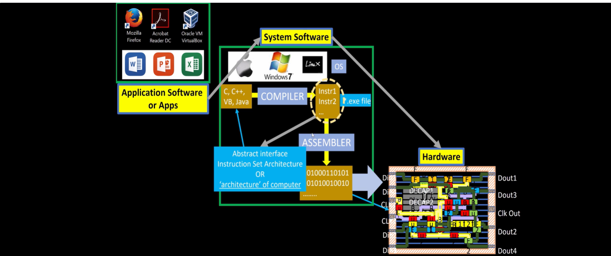
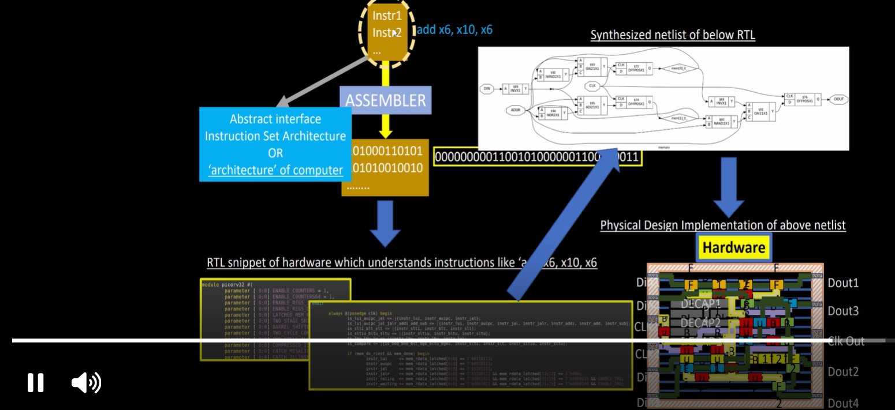

# Day 1 – Introduction to OpenLANE and ASIC Design Flow

## Objective
The first day focused on understanding the fundamentals of ASIC design, the complete RTL-to-GDSII flow, OpenLANE, Process Design Kit (PDK), and the role of EDA tools in digital IC design.

---

## Topics Covered

### 1. Software to Hardware Flow
- Difference between Application Software and System Software.
- How high-level programming languages are converted into machine instructions.
- Role of Compiler and Assembler.
- How machine instructions are executed by the processor hardware.

---

### 2. Instruction to Hardware Execution
- Understanding the Instruction Set Architecture (ISA).
- Conversion of assembly instructions into binary code.
- Relationship between RTL, synthesized netlist, physical design, and hardware implementation.

---

### 3. RISC-V SoC Overview
- Basic architecture of a RISC-V SoC.
- Integration of GPIO, SRAM, SPI, UART, Analog IPs, and Foundry IPs.
- Understanding chip-level organization.

---

### 4. Digital ASIC Design
ASIC design requires three essential components:

- RTL Design
- EDA Tools
- Process Design Kit (PDK)

These work together to generate the final ASIC layout.

---

### 5. Open-Source ASIC Ecosystem
The open-source ASIC ecosystem consists of:

- RTL Designs
- Open-source EDA Tools
- Open PDK

These components together enable complete ASIC implementation.

---

### 6. Process Design Kit (PDK)
A Process Design Kit contains technology-specific information required for chip fabrication.

It includes:

- Design Rules
- Device Models
- Standard Cell Libraries
- I/O Libraries
- Technology Files

---

### 7. EDA Tools
EDA (Electronic Design Automation) tools automate different stages of ASIC design including:

- HDL Simulation
- Logic Synthesis
- Floorplanning
- Placement
- Clock Tree Synthesis
- Routing
- Static Timing Analysis
- DRC & LVS
- Sign-off

---

### 8. RTL to GDSII Flow
The RTL-to-GDSII flow consists of:

1. Synthesis
2. Floorplanning
3. Power Planning
4. Placement
5. Clock Tree Synthesis
6. Routing
7. Sign-off

The final output is the GDSII layout file used for fabrication.

---

### 9. OpenLANE
OpenLANE is an open-source automated RTL-to-GDSII flow designed for ASIC implementation using the SkyWater130 PDK.

Its goal is to generate manufacturable layouts with minimal manual intervention.

---

### 10. OpenLANE ASIC Flow
OpenLANE integrates synthesis, floorplanning, placement, CTS, routing, and sign-off into one automated flow.

---

### 11. Physical Verification
Physical verification ensures that the final layout satisfies fabrication requirements.

It mainly includes:

- Design Rule Check (DRC)
- Layout Versus Schematic (LVS)

These checks validate both manufacturability and functional correctness.

---

## Key Takeaways

- Understood the complete ASIC Design Flow.
- Learned the purpose of RTL, PDK, and EDA tools.
- Explored the OpenLANE open-source design flow.
- Studied the RTL-to-GDSII implementation process.
- Learned the importance of DRC and LVS verification before fabrication.
